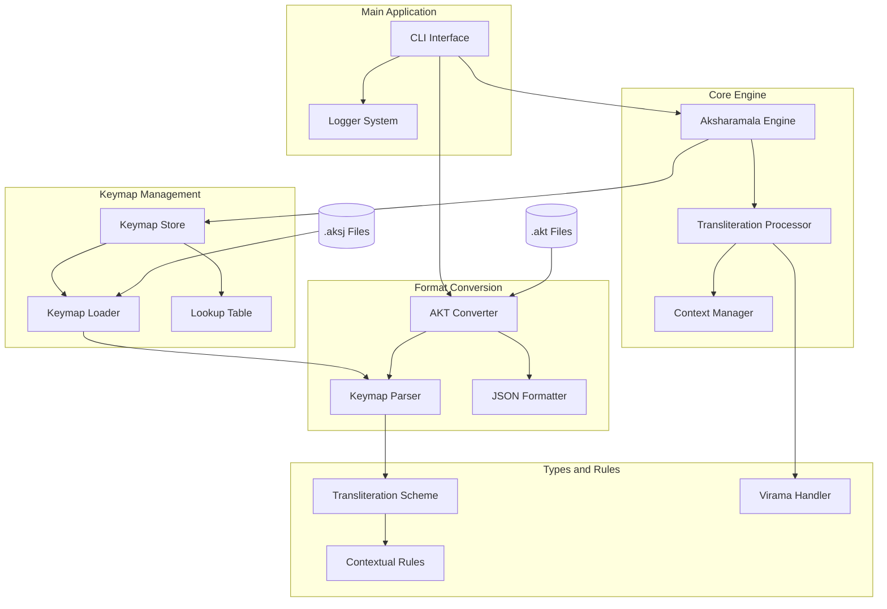

# Aksharamala - Transliteration for Indian Languages

## Overview
`Aksharamala` is a modern, extensible transliteration system for Indian languages, reviving and expanding upon the original Aksharamala project, which dates back to 1989 as a college project and was later commercialized in the early 2000s. This version, rewritten in Go, brings advanced transliteration capabilities with a focus on portability, cloud integration, and extensibility.

## Purpose
Indian language data often exists in legacy formats or custom encodings, making it inaccessible to modern applications. `Aksharamala bridges this gap by providing tools to convert and transliterate such data into standardized Unicode representations. It also facilitates **cross-language transliteration**, allowing conversion from **Sanskrit to Hindi, Telugu, or other Indic scripts**. With a new focus on **AI-driven text processing**, Aksharamala aims to integrate seamlessly into **modern NLP and cloud-based systems**.

## Features
- **Transliteration Engine**:
  - Support for customizable mappings.
  - Handles multiple languages and scripts.
- **Legacy Compatibility**:
  - Converts old Aksharamala (`.akt`) files into JSON (`.aksj`) while preserving comments and structure.
- **Extensibility**:
  - JSON-driven configuration for easy customization.
  - Modular design enables new languages and scripts to be added seamlessly.
- **Smart Processing**:
  - Intelligent virama handling (with support for various modes that are helpful for Indic).
  - Optional logging and verbose modes for debugging.

## Quick Start
### Prerequisites
- Go 1.20+
- A working environment for Go projects.

### Installation
```bash
# Clone the repository
$ git clone https://github.com/s-annam/aksharamala.git

# Navigate to the directory
$ cd aksharamala

# Build the project
$ go build ./cmd/aksharamala
```

### Usage
To convert old `.akt` files to `.aksj` format:
```bash
go run ./cmd/akt_converter convert -input myfile.akt -output myfile.aksj
```
For dry-run mode:
```bash
go run ./cmd/akt_converter convert -input myfile.akt -output myfile.aksj -dry-run
```

## Architecture
1. **Transliteration Core**:
   - Parses and processes mappings.
   - Handles transliteration with contextual awareness.
2. **Keymap Store**:
   - Manages transliteration schemes and metadata.
   - Validates mappings and supports efficient lookup.
3. **Utilities**:
   - Supports metadata extraction and comment normalization.
4. **Logger**:
   - Provides configurable logging (debug/production modes).

**Architecture Overview**: The diagram below illustrates the core components and their interactions.



## Roadmap
### Completed
- Basic `.akt` to `.aksj` conversion.
- Transliteration with configurable mappings.

### Future Enhancements
* **AI-Driven AKSJ Creation:** Implement machine learning models to analyze .akt files and generate .aksj mappings intelligently, reducing manual effort.
* **Dynamic Language Support:** Add runtime language detection and mapping support to handle multi-script input dynamically.
* **API Integration:** Develop REST APIs for transliteration tasks, enabling integration with other tools and systems.

See the the list of issues and planned enhancements in the [Issues](https://github.com/s-annam/aksharamala/issues) section that are more immediate. **Please reach out if you’d like to contribute!**

## History
**Aksharamala** in 2025 builds upon the legacy `Aksharamala` project, which was first developed as a transliteration tool in 1989 (Turbo Pascal), later expanded into a commercial product for Windows (C++/MFC) in the early 2000s, and now revived in Go for modern use cases. For a detailed history, see [HISTORY.md](HISTORY.md).

## Contributing
Contributions are welcome! Please read [CONTRIBUTING.md](docs/CONTRIBUTING.md) for details on our process.

## License
This project is licensed under the GNU Affero General Public License (AGPL-3.0-or-later). See [LICENSE](LICENSE) for details.

## Acknowledgments
Special thanks to the community and contributors of the original Aksharamala project for inspiring this modernization effort.
